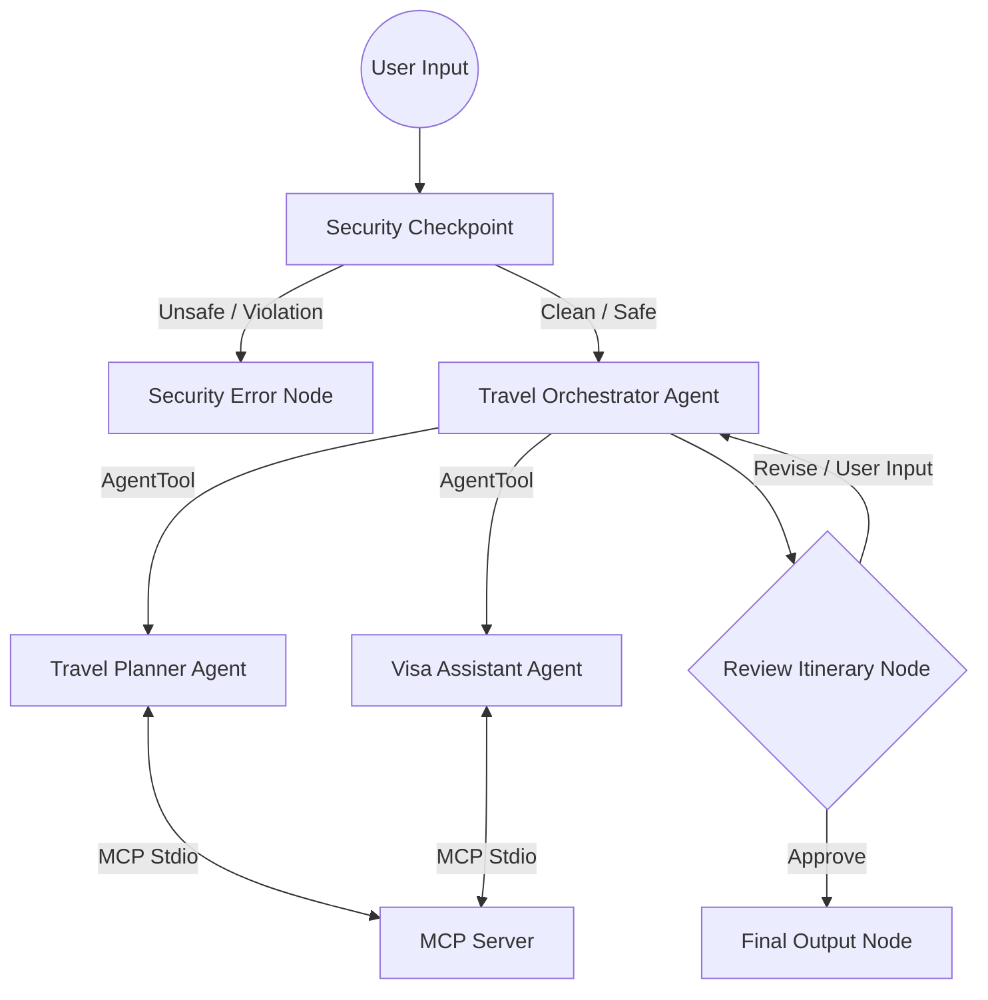
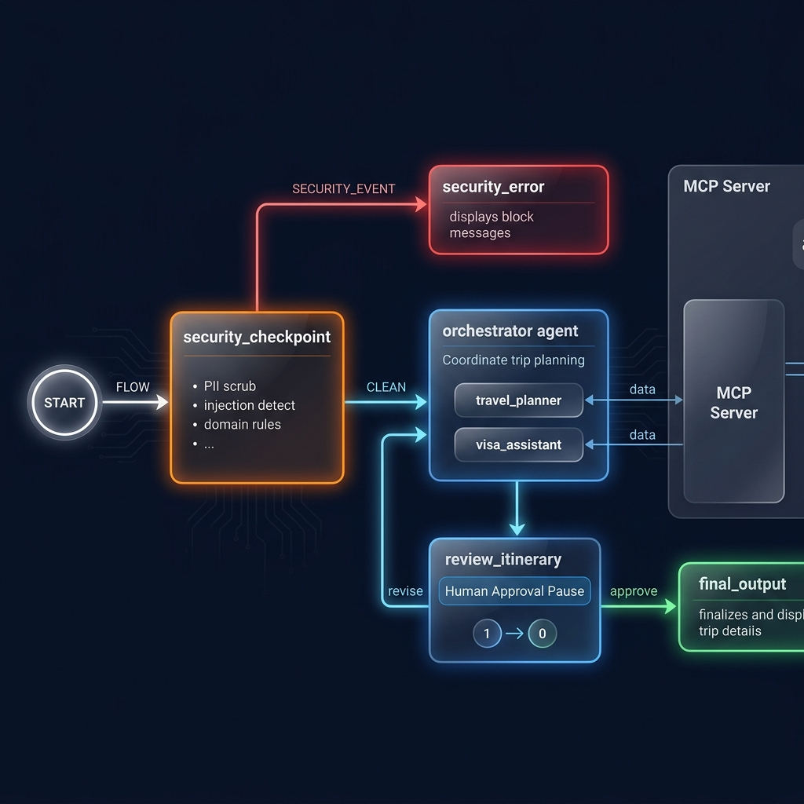

# travel-concierge

An end-to-end travel planner coordinating personalized itineraries, weather checks, real-time alternate routing, and visa/document checklists.

## Prerequisites

- **Python:** Version 3.11+ is required.
- **uv:** Astral's fast Python packaging tool.
- **Gemini API Key:** An active key from [Google AI Studio](https://aistudio.google.com/apikey).

## Quick Start

```bash
git clone <repo-url>
cd travel-concierge
cp .env.example .env   # add your GOOGLE_API_KEY
make install
make playground        # opens UI at http://localhost:18081
```

## Architecture Diagram



## How to Run

- `make playground` → Launches the interactive ADK playground UI on [http://localhost:18081](http://localhost:18081).
- `make run` → Starts the FastAPI application local web server on port `8000`.

## Sample Test Cases

### Test Case 1: Standard Tokyo Planning (Indian Passport)
- **Input:** `"I want to plan a 5-day trip to Tokyo, Japan from July 10 to July 15. My budget is $3000. I hold an Indian passport."`
- **Expected:** The `orchestrator` parses input and delegates to `travel_planner` (creates day-by-day Tokyo itinerary, compares flight/hotels, checks weather via MCP) and `visa_assistant` (returns Japanese tourist visa details for Indian passport). The flow pauses at `review_itinerary`.
- **Check:** In the playground UI, the travel plan is displayed with a request for approval.

### Test Case 2: User Requested Revisions
- **Input:** `"I want to plan a 3-day trip to Paris. Budget is $1500."` followed by user response `"Change the flight option to a premium carrier."` when prompted by the review node.
- **Expected:** First, the orchestrator drafts a Paris plan and pauses. When the user requests the revision, the review node sets the route to `"revise"` and loops back to the orchestrator to update the itinerary.
- **Check:** The playground UI shows the updated Paris itinerary reflecting the premium carrier adjustment.

### Test Case 3: Security Violation (Blacklisted Country & High Budget)
- **Input:** `"I want to plan a trip to North Korea with a budget of $60000. My email is user@example.com."`
- **Expected:** The `security_checkpoint` scrubs the email address, blocks the request due to the blacklisted travel zone and the budget exceeding `$50,000`, and routes directly to the `security_error` node without executing sub-agents.
- **Check:** The playground UI outputs `"Security block: Requested budget $60000 exceeds the travel policy limit of $50000."` or destination blacklisted errors.

## Troubleshooting

1. **Error: Model 404 (RESOURCE_EXHAUSTED / Not Found)**
   - *Cause:* Using an old or retired model name (like gemini-1.5-*), or Vertex credentials aren't configured.
   - *Fix:* Ensure `.env` has `GEMINI_MODEL=gemini-2.5-flash` and `GOOGLE_GENAI_USE_VERTEXAI=False` to use the free-tier AI Studio key.
2. **Error: duplicate edges validation error during graph init**
   - *Cause:* Having multiple edges defined between the same node source and target.
   - *Fix:* Consolidate convergent edges into a single edge or route using a single unconditional edge.
3. **Windows Hot-Reload Not Updating Code**
   - *Cause:* Windows file watcher conflicts with the event loop when spawning subprocesses.
   - *Fix:* Fully stop the running server by running `Get-Process -Id (Get-NetTCPConnection -LocalPort 18081, 8090 -ErrorAction SilentlyContinue).OwningProcess | Stop-Process -Force` in PowerShell, then run `make playground` again.

## Assets

### Cover Banner


### Agent Workflow Architecture


## Demo Script

A conversational 3-4 minute presentation and demo narration script is available in [DEMO_SCRIPT.txt](file:///c:/Users/sujni/adk/travel-concierge/DEMO_SCRIPT.txt).

## Push to GitHub

1. Create a new repo at https://github.com/new
   - Name: travel-concierge
   - Visibility: Public or Private
   - Do NOT initialize with README (you already have one)

2. In your terminal, navigate into your project folder:
   ```bash
   cd travel-concierge
   git init
   git add .
   git commit -m "Initial commit: travel-concierge ADK agent"
   git branch -M main
   git remote add origin https://github.com/<your-username>/travel-concierge.git
   git push -u origin main
   ```

3. Verify .gitignore includes:
   ```
   .env          ← your API key — must NEVER be pushed
   .venv/
   __pycache__/
   *.pyc
   .adk/
   ```

⚠ NEVER push .env to GitHub. Your API key will be exposed publicly.
