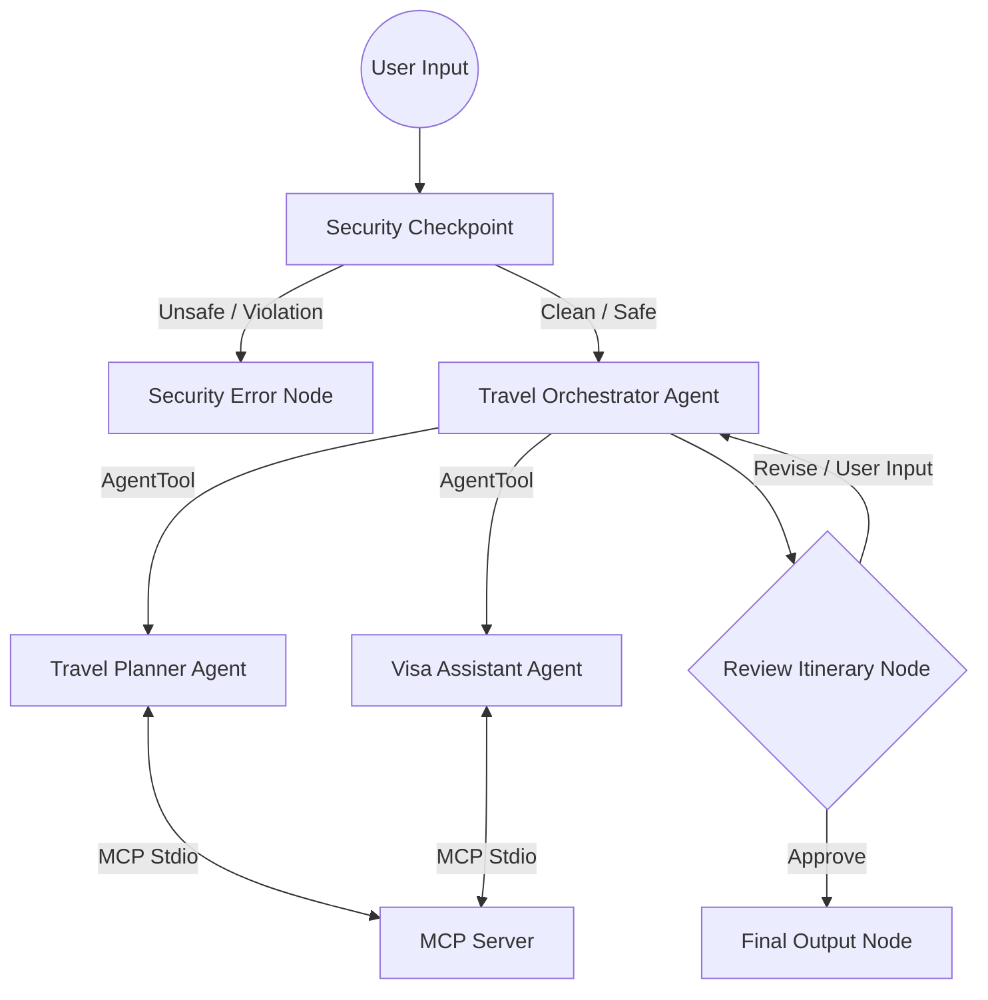

# Submission Write-Up: travel-concierge

## Problem Statement
Planning international trips is time-consuming and fragmented. Travelers struggle to combine day-by-day itineraries, check destination weather, compare accommodation/flight budgets, and research complex visa rules and required documentation deadlines. The `travel-concierge` solves this by acting as a single, secure orchestrator that automates all these tasks, presenting a customized, consolidated itinerary and visa checklist in one interactive interface.

## Solution Architecture

## Concepts Used

- **ADK Workflow (Graph API):** Configured the complete orchestration in [agent.py](file:///c:/Users/sujni/adk/travel-concierge/app/agent.py#L149-L162) using `Workflow` and functional/agent nodes with explicit edges, complying with ADK 2.0.
- **LlmAgent:** Created specialized LLM nodes for `travel_planner`, `visa_assistant`, and `orchestrator` in [agent.py](file:///c:/Users/sujni/adk/travel-concierge/app/agent.py#L38-L96).
- **AgentTool:** Configured sub-agent delegation under the `orchestrator` in [agent.py](file:///c:/Users/sujni/adk/travel-concierge/app/agent.py#L95) to allow it to invoke sub-agents like functions.
- **MCP Server:** Implemented a domain-specific Model Context Protocol server in [mcp_server.py](file:///c:/Users/sujni/adk/travel-concierge/app/mcp_server.py) using the stdio transport to execute local python functions.
- **Security Checkpoint:** Integrated a security checkpoint node at the graph root in [agent.py](file:///c:/Users/sujni/adk/travel-concierge/app/agent.py#L143-L200) checking for PII, injections, and corporate budget policy.
- **Agents CLI:** Scaffolding, local playground execution, and environment initialization were fully driven by `agents-cli`.

## Security Design

1. **PII Scrubbing:** Automatically redacts high-risk inputs including passport numbers, emails, and phone numbers before they hit the LLMs to protect user privacy.
2. **Prompt Injection Check:** Scans inputs against a keyword list (`ignore previous instructions`, `jailbreak`, etc.) to prevent malicious attempts to bypass system logic.
3. **Structured Audit Logs:** Writes JSON logs to `stderr` recording transaction health (INFO, WARNING, CRITICAL severity levels) for developers and admins to track failures or safety events.
4. **Domain Travel Policy:** Rejects travel to blacklisted high-risk advisory countries (e.g. North Korea, Syria, Yemen) and enforces a maximum budget policy threshold ($50,000) to flag fraud.

## MCP Server Design

Exposes three tools using the `FastMCP` protocol:
1. `get_destination_weather`: Checks weather history/forecasts during travel windows.
2. `search_flights_hotels`: Yields local flight/hotel recommendations matching user budget constraints.
3. `check_visa_requirements`: Fetches visa entry rules, required document checklists, and application deadlines based on passport country.

## Human-in-the-Loop (HITL) Flow
To guarantee traveler satisfaction, a pause occurs at the `review_itinerary` node ([agent.py:L170-L191](file:///c:/Users/sujni/adk/travel-concierge/app/agent.py#L170-L191)) via yielding `RequestInput`. The system stops execution and presents the plan to the traveler. 
- If the traveler replies with `"approve"`, it routes to `final_output`.
- If the traveler describes adjustments (e.g. *"Change my hotel to a budget hostel"*), the system records the feedback in the state and routes back to the `orchestrator` for revision.

## Demo Walkthrough
1. **Tokyo Standard Run:** The user prompts for Tokyo planning. The orchestrator pulls flight/hotel recommendations and the visa checklist (which shows Japanese visa requirements for Indian nationals). It halts, awaiting approval. User replies `"approve"`, and it completes.
2. **Interactive Revision:** The user wants a Paris trip. The orchestrator plans it, and pauses. The user requests: *"Choose a premium flight instead"*. The system loops back, queries the flight MCP tool again for premium options, updates the itinerary, and requests approval again.
3. **Policy Blocking:** The user requests a trip to Syria. The security node intercepts it immediately, flags the destination as dangerous, records a `WARNING` in the audit log, and stops execution.

## Impact / Value Statement
The `travel-concierge` transforms trip planning from hours of manual searching across multiple websites into an interactive 2-minute conversation. It enforces security compliance, handles stateful user revision feedback, integrates local system-level tooling via MCP, and outputs an end-to-end trip guide containing both the fun parts (itineraries) and the critical parts (visas).
